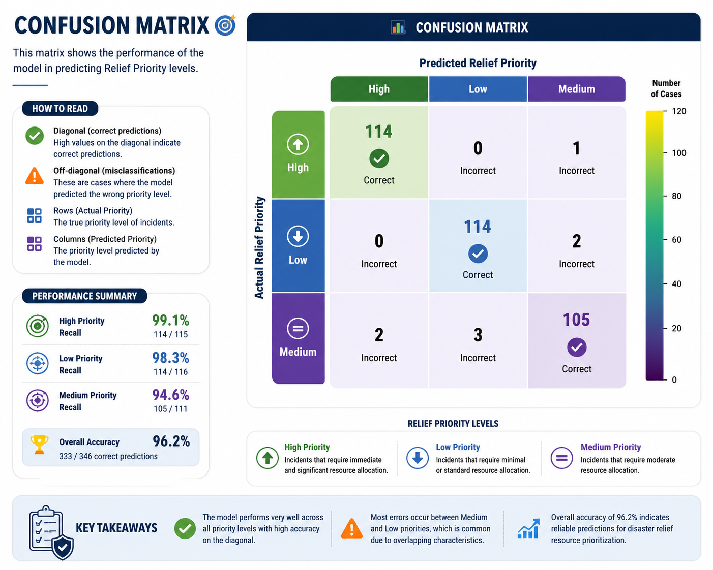
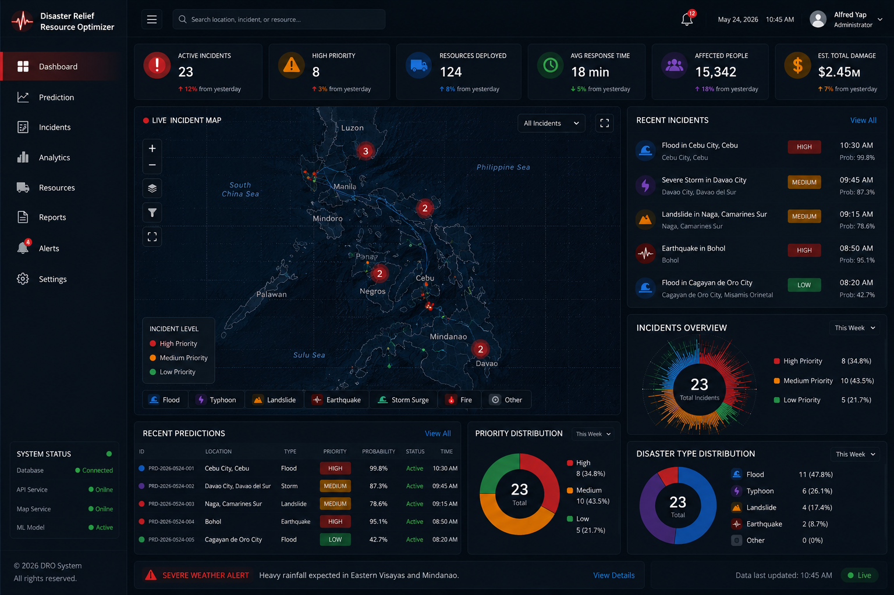

# 🌍 Disaster Relief Resource Optimizer

> AI-powered decision support system that predicts disaster relief priority using machine learning and provides an interactive GIS dashboard for emergency response planning.


---

# 📖 Overview

Natural disasters such as typhoons, floods, earthquakes, landslides, and volcanic eruptions frequently impact communities across the Philippines, creating significant challenges for emergency responders and disaster management agencies. During large-scale disasters, decision-makers must quickly determine which incidents require immediate attention while efficiently allocating limited emergency resources. Traditional prioritization methods often rely on manual assessment and expert judgment, which can be time-consuming, inconsistent, and difficult to scale during multiple simultaneous emergencies.

The **Disaster Relief Resource Optimizer** is an AI-powered decision support system designed to enhance disaster response by automatically predicting the relief priority of reported incidents using machine learning. By analyzing disaster-related indicators such as the affected population, infrastructure damage, casualty rate, homeless rate, disaster duration, and disaster type, the system classifies incidents into **Low**, **Medium**, or **High** relief priority and provides a prediction probability to support informed decision-making.

The system integrates a **FastAPI** backend, **XGBoost** machine learning model, **PostgreSQL** database, and an interactive **React** web dashboard with GIS visualization to provide a complete disaster management platform. Emergency responders can submit incident reports, monitor active disasters, visualize affected locations on an interactive map of the Philippines, analyze disaster trends, and manage incident records through an intuitive user interface.

Beyond prediction, the platform serves as a centralized disaster monitoring and analytics tool by storing historical incident records, generating real-time visualizations, and providing insights through feature importance analysis, confusion matrices, and correlation heatmaps. These capabilities enable disaster management agencies to make faster, data-driven decisions and improve the efficiency of emergency response operations.

Overall, the project demonstrates the practical application of **Artificial Intelligence**, **Machine Learning**, **Geographic Information Systems (GIS)**, and **Full-Stack Web Development** in addressing real-world disaster management challenges while promoting more effective resource allocation and emergency preparedness.

---

# 🎯 Problem Statement

The Philippines is one of the most disaster-prone countries in the world, experiencing frequent typhoons, floods, earthquakes, landslides, and volcanic eruptions that threaten lives, infrastructure, and local communities. During disaster events, emergency response teams must rapidly assess multiple incidents, identify the most critical situations, and allocate limited resources where they are needed most.

However, disaster prioritization is often performed through manual assessment and expert judgment, which can become inefficient during large-scale emergencies involving numerous simultaneous incidents. The increasing volume of disaster reports, combined with limited personnel and emergency resources, makes it difficult for decision-makers to consistently determine which affected areas require immediate intervention.

Current disaster response processes face several challenges, including:

- Delays in identifying high-priority incidents.
- Limited emergency resources and relief supplies.
- Simultaneous disasters occurring across multiple locations.
- Subjective and inconsistent prioritization of disaster severity.
- Lack of data-driven decision support for emergency response planning.
- Difficulty visualizing disaster incidents and monitoring response status in real time.

These challenges can result in slower emergency response, inefficient resource allocation, and increased risks for affected communities.

To address these issues, there is a need for an intelligent decision support system capable of analyzing disaster-related data and automatically predicting the relief priority of reported incidents. Such a system can assist disaster management agencies by providing objective, data-driven recommendations that improve prioritization accuracy, accelerate response planning, and optimize the allocation of emergency resources.

---

# 💡 Proposed Solution

The **Disaster Relief Resource Optimizer** is an AI-powered decision support system designed to improve disaster response by assisting emergency management agencies in prioritizing disaster incidents based on their severity. Instead of relying solely on manual assessment, the system leverages machine learning to analyze disaster-related information and generate objective, data-driven relief priority predictions.

The solution utilizes an **XGBoost multi-class classification model** trained on historical disaster data to classify reported incidents into **Low**, **Medium**, or **High** relief priority. Each prediction is accompanied by a **probability score**, allowing emergency responders to evaluate the confidence of the model's recommendation and support more informed decision-making.

To provide a complete disaster management platform, the system integrates multiple components into a unified workflow:

- **Machine Learning Prediction** – Automatically predicts the relief priority of disaster incidents using key disaster indicators.
- **Incident Management** – Enables users to submit, update, and monitor disaster reports while maintaining historical incident records.
- **Interactive GIS Dashboard** – Displays disaster incidents on an interactive map of the Philippines, allowing responders to visualize affected areas and monitor ongoing emergencies.
- **Analytics and Reporting** – Presents disaster trends, priority distributions, model evaluation metrics, and historical data through interactive charts and visualizations.
- **RESTful API** – Provides secure and scalable API endpoints that enable communication between the frontend application, backend services, and machine learning model.

The system aims to support emergency responders by reducing the time required to assess disaster reports, improving the consistency of incident prioritization, and enabling more efficient allocation of limited relief resources. By combining **Artificial Intelligence**, **Geographic Information Systems (GIS)**, and **modern web technologies**, the platform delivers a scalable and intelligent solution for disaster management and emergency response planning.

---

# ✨ Features

## 🤖 Machine Learning

- Relief Priority Prediction
- Prediction Probability
- Multi-class Classification
- XGBoost Model

## 📍 Incident Management

- Create Incident Reports
- Update Incident Status
- Store Predictions
- Historical Records

## 📊 Analytics

- Dashboard
- Priority Distribution
- Disaster Distribution
- Prediction History

## 🗺 Interactive GIS Map

- Philippine disaster map
- Incident markers
- Priority color coding
- Popups
- Clustering

---

# 🏗️ System Architecture

Add your system architecture illustration here.

```text
Frontend (React)
        │
        ▼
 FastAPI REST API
        │
        ▼
Machine Learning Model (XGBoost)
        │
        ▼
 PostgreSQL Database
```

---

# 🧠 Machine Learning Pipeline

```
Historical Dataset
      │
      ▼
Data Cleaning
      │
      ▼
Feature Engineering
      │
      ▼
Label Encoding
      │
      ▼
Train/Test Split
      │
      ▼
XGBoost
      │
      ▼
Prediction
      │
      ▼
REST API
```

---

# 🛠 Technology Stack

### Backend

- FastAPI
- SQLAlchemy
- PostgreSQL
- Alembic

### Machine Learning

- XGBoost
- Scikit-learn
- Pandas
- NumPy

### Frontend

- React
- Tailwind CSS
- Leaflet
- Recharts

### DevOps

- Docker
- Docker Compose
- GitHub

---

# 📊 Results & Model Evaluation

## 🎯 Model Performance

| Metric    |  Score |
| --------- | -----: |
| Accuracy  | 97.98% |
| Precision | 97.98% |
| Recall    | 97.98% |
| F1 Score  | 97.98% |

---

## 🔥 Confusion Matrix



Explain what the confusion matrix shows.

---

## 📈 Feature Importance


Explain the most influential features.

---

## 📊 Correlation Heatmap


Discuss the relationships among the features.

---

# 📷 Dashboard Preview

## Dashboard



---

## Prediction Page


---

## Incidents


---

## Analytics


---

## Philippine GIS Map


---

# 🚀 REST API

### POST

```
/disaster_relief_optimizer/predict
```

### PUT

```
/disaster_relief_optimizer/{id}/status
```

---

# 📂 Project Structure

```text
frontend/
backend/
model_weights/
reports/
tests/
Dockerfile
docker-compose.yml
README.md
```

---

# 🔮 Future Improvements

- Live PAGASA Weather API
- Satellite Data Integration
- Route Optimization
- SMS Notifications
- Mobile Application
- Resource Allocation Engine
- Multi-user Authentication

---

# 👨‍💻 Author

**Alfred Quinto Yap**

Bachelor of Science in Computer Science

- Artificial Intelligence
- Machine Learning
- Data Science
- Computer Vision

GitHub:
https://github.com/apyotDev

LinkedIn:
https://linkedin.com/in/alfred-yap

---

# ⭐ If you found this project useful, consider giving it a star!
